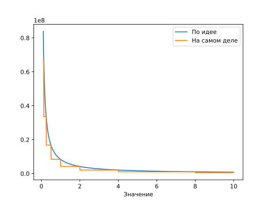
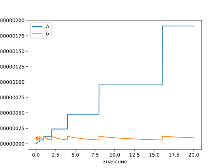

<!-- -*- coding: utf-8 -*- -->
Числа с плавающей запятой:
представление, распределение; комплексные числа

# Вводная информация

- - - - - -

## О чём речь?

Десятичный разделитель — в англоязычных странах — точка, в России,
Европе, Южной Америке — запятая.

Значение составляется из *мантиссы* и *экспоненты*:

$$v = \pm M\times Q^E$$

$M$ — мантисса, $E$ — экспонента. Кроме того, для однотипных вычислений
задается наперед $Q$ — знаменатель экспоненты. Часто $Q$ принимают
равным основанию системы счисления. Например, в программе запись
`-3.1415926e-5` обозначает $-\pi\cdot10^{-5}$.

= = = = = =

# Хранение и операции

- - - - - -

## Нормализация и представление

- Стандартная инженерная нормализация — $M \in [1,Q)$ и отдельное
  обозначение нуля;

- Машинная нормализация (принято) — IEEE-754 — наиболее распространённый стандарт, нормализация как
  инженерная.

- - - - - -

## Ещё варианты представления

  1. **Наивно** — $M \in [0,{1\over Q})$. $Q$ — основание системы счисления, то
     целая часть мантиссы всегда 0, и её можно не хранить. Не
     допускает неоднозначности и представляет 0.

    - При машинной нормализации остаются свободные значения
      экспоненты при нулевой мантиссе. Принятые стандартные
      константы: $\infty$, $-\infty$ и NAN (not a number).

    - Для расширения диапазона на машине можно брать $Q$ равным не
      2, а степени 2.

  2. **Идеально** — хранить с фиксированной точностью логарифм числа ($E$ с
     фиксированной дробной частью). Даёт действительно постоянную
     $\delta$, но не ясно, как складывать =).

  3. **Перспективно** — [Unum](https://en.wikipedia.org/wiki/Unum_(number_format&#41;)

- - - - - -

## IEEE 754 binary32

### Варианты IEEE 754

-   binary16
-   binary32 (Intel С float)
-   binaty64 (Intel C double)
-   binary128
-   extended 80 (Intel C long double, не все компиляторы) — не базовый
    IEEE
-   decimal 32, 64, 128

- - - - - -

## Формат (binary32)

$b_{-k}$ — биты мантиссы в соответствии со старшинством.

$$
v = (-1)^s(1.b\_{-1}b\_{-2}\ldots b\_{-23})\_2 \times 2^{e-127}
= (-1)^s (1 + \sum\_{i=1}^{23} b\_{-i} 2^{-i} )\times 2^{e-127}
$$

-   Экспонента `FF` Зарезервирована для 4 значений — $\pm\infty$ и
    `NaN`
-   Экспонента `00` Зарезервирована для денормализованных чисел

- - - - - -

## Денормализованные числа

Абсолютная величина *меньше* $1\times 2^{1-127=-126}$

$$
v = (-1)^s(0.b\_{-1}b\_{-2}\ldots b\_{-23})\_2 \times 2^{-126}
= (-1)^s (\sum\_{i=1}^{23} b\_{-i} 2^{-i} )\times 2^{-126}
$$

Понятно, что $$(0.111\ldots 111)\_2 \times 2^{0-126}$$ близко к

$$1 \times 2^{-126}.$$

- - - - - -

## Плотность

 <!--.element: style="width: 90%;" -->

- - - - - -

## Относительная погрешность; центр

$$2 \Delta_r \in (\frac{1/2}{2^{23}},\frac{1}{2^{23}}]$$ Единица —
приблизительный центр $I_f^{(m)}$

## Машинный эпсилон

$$\varepsilon = \min z: I_f^{(m)}(1) \neq I_f^{(m)}(1+z)$$
$$\varepsilon = \frac{1}{2^{23}}$$

- - - - - -

## Погрешность ( = 1/(2 плотности) )

 <!--.element: style="width: 90%;" -->

- - - - - -

## Операции

При сложении требуется денормализация. Для вариантов (1) (IEEE 754) и
(2) по-разному. Для «самого правильного» варианта (3) даже не
знаю, как =).

Пример: $$(
\sum\_{i=1}^N \frac{1}{a^i}
)^{(m)} \neq (
\sum\_{i=N}^1 \frac{1}{a^i}
)^{(m)}$$

### Упражнение

Попробовать составить функции с показанных графиков и нарисовать при
помощи любого математического пакета.

= = = = = =

# Комплексные числа

- - - - - -

## Информация к размышлению

Могут быть представлены как в векторной, так и в полярной форме.

-   Так же, как вещественные числа представляются с плавающей запятой
    неравномерно, полярная форма ещё добавит неравномерности.

-   Выбирается по задаче.

-   Полярный аргумент логично представить равномерно, т.е. $[0,2\pi)$ с
    фиксированной точностью, или даже $[0,\pi)$ и «отрицательный
    модуль».

- - - - - -

## Плотность векторного представления

### 

{width="12cm"}

### 

{width="10cm" height="9cm"}

Плотность полярного представления
---------------------------------

### 

{width="12cm"}

### 

{width="10cm" height="9cm"}
