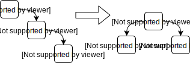
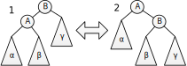

<span id="slides-title" hidden>Деревья</span>
<span id="slides-author" hidden>Сартасов Станислав Юрьевич, Луцив Дмитрий Вадимович</span>

Введение
========

- - - - - -

## Массивы и бинарные деревья поиска

Добавление и поиск данных в массивах:

-   Для несортированных: $\mathcal{O}(N)$ на поиск, $O(1)$ на добавление в конец

-   Для сортированных: $\mathcal{O}(\log_2 N)$ для бинарного поиска, $\mathcal{O}(N)$ для добавления,
    в худшем случае $\mathcal{O}(N^{2})$ для QSort

Существуют структуры данных с лучшими оценками сложности для этих
операций.

- - - - - -

## Бинарное дерево

-   Бинарное дерево — структура данных, которая представляет собой либо
    пустой элемент, либо элемент с двумя потомками, какждый из которых
    является бинарным деревом.

-   Операции: вставка, удаление, обход.

-   Бинарное дерево поиска — бинарное дерево с определённой на нём
    операцией поиска и, возможно, дополнительной информацией в узлах для
    выполнения этой операции.

-   Потомки каждого элемента определяются как левое и правое поддерево.
    В правом поддереве хранятся значения больше, чем в текущем узле, в
    левом — меньше.


- - - - - -

## Вставка 

```
(define (make-bin-tree) '())

(define (insert value tree)
  (if (eq? tree '())
      (list value '() '())
      (let* ((l (car (cdr  tree)))
             (r (car (cddr tree)))
             )
        (if (< value (car tree))
            (list (car tree) (insert value l) r)
            (list (car tree) l (insert value r))
            )
        )
      )
  )
```

- - - - - -

## Поиск

```
(define (search value tree)
  (if (eq? tree '())
      #f
      (if (eq? value (car tree))
          #t
          (if (< value (car tree))
              (search value (car (cdr  tree)))
              (search value (car (cddr tree)))
              )
          )
      )
```

- - - - - -

## Ещё ЛИСПа?

-{pause}-

Ну уж нет...


= = = = = =

# Зачем нужны деревья поиска на практике

- - - - - -

## Основная задача

Реализация словарных структур данных.
В дереве хранятся не только ключи, но и значения, а чаще — ссылки на них. Польза такая же, как и от отсортированного массива

<div class="fragment" />

## Помимо этого

Реализация множеств для произвольных типов данных

<div class="fragment" />

## В обоих случаях

Требуется отношение порядка на множестве данных ключей

= = = = = =

# Самобалансирующиеся деревья

- - - - - -

## Что это и зачем?

### Что?

<div style="text-align: center;">
 <!--.element: style="width: 60%;" -->
</div>

Самобалансирующиеся деревья — бинарные деревья поиска, которые
восстанавливают баланс после вставки элемента.

Баланс — равенство (возможно, приблизительное) высот поддеревьев или
производных величин.

<div class="fragment" />

### Зачем?

Потому что бинарный поиск достигает $\mathcal{O}(\log_2 N)$ только на идеально сбалансированной структуре данных. Например, на массиве =)

- - - - - - 

## Поворот бинарного дерева

<div style="text-align: center;">
 <!--.element: style="width: 60%;" -->
</div>

$a \in \alpha, b \in \beta, c \in \gamma, a<A<b<B<c$


= = = = = =

# АВЛ-дерево

<div class="fragment" />

* [Георгий Максимович Адельсон-Вельский](https://ru.wikipedia.org/wiki/%D0%90%D0%B4%D0%B5%D0%BB%D1%8C%D1%81%D0%BE%D0%BD-%D0%92%D0%B5%D0%BB%D1%8C%D1%81%D0%BA%D0%B8%D0%B9,_%D0%93%D0%B5%D0%BE%D1%80%D0%B3%D0%B8%D0%B9_%D0%9C%D0%B0%D0%BA%D1%81%D0%B8%D0%BC%D0%BE%D0%B2%D0%B8%D1%87)
* [Евгений Михайлович Ландис](https://ru.wikipedia.org/wiki/%D0%9B%D0%B0%D0%BD%D0%B4%D0%B8%D1%81,_%D0%95%D0%B2%D0%B3%D0%B5%D0%BD%D0%B8%D0%B9_%D0%9C%D0%B8%D1%85%D0%B0%D0%B9%D0%BB%D0%BE%D0%B2%D0%B8%D1%87)

Институт теоретической и экспериментальной физики, Мехмат МГУ, 1962 г.

- - - - - -

## Термины и определения

АВЛ-дерево — вариант двоичного дерева поиска, в котором в каждом узле
хранится информация о разнице высот поддеревьев.

$h(L) > h(R) \rightarrow -1$

$h(L) = h(R) \rightarrow 0$

$h(L) < h(R) \rightarrow +1$

- - - - - -

## Алгоритм вставки

Пусть к потомку вершины $X$ — (под)дереву $L$ с высотой $h_0(L)$ добавляется новый узел, и это
приводит к $h(L)=h_0(L)+1$.

-   $h_0(L) < h_0(R) \rightarrow h(X)=h_0(X)$, дерево становится более
    сбалансированным.

-   $h_0(L) = h_0(R) \rightarrow$ дерево становится немного
    несбалансированным, но это не приводит к необходимости балансировки.

-   $h_0(L) > h_0(R) \rightarrow$ дерево становится ещё более
    несбалансированным, что приводит к необходимости балансировки.

- - - - - -

## Балансировка

Для восстановления баланса требуется либо один, либо два поворота.

Выбор того или иного числа поворотов определяется знаками разниц
балансов самого нижнего узла с модулем разницы 2 и корня его более
высокого поддерева.

Вставка занимает $\mathcal{O}(log_2 N)$

- - - - - -

## Удаление

После удаления листа происходит балансировка при возврате наверх.

* Если удаляется лист, балансируются вершины от листа до корня

* Если внутренняя вершина — на её место копируется ближайший по значению лист,
  после чего лист удаляется по уже описанной процедуре

- - - - - -

### Упражнение

Реализовать АВЛ-дерево на любом языке программирования;
предположительно легче это сделать, используя неизменяемые структуры данных.

= = = = = =

# Красно-чёрное дерево

- - - - - -

## Термины и определения

Красно-чёрное дерево (Red-Black tree, RB-tree) — бинарное дерево поиска,
в котором у каждого элемента есть дополнительный бит информации — его
цвет.

10 pt

Пустые элементы считаются полноценными элементами дерева и являются
листьями.

### 

Чёрная высота узла (Black Height, BH) — количество чёрных узлов на
простом пути от данного узла до листа, не считая самого узла.

Четыре правила RB-дерева:

1.  корень д.б. чёрным;

2.  непосредственные потомки красного узла д.б. чёрными;

3.  на всех ветвях, ведущих от корня к листьям, одинаковое количество
    чёрных узлов;

4.  листья чёрные и не содержат данных.

Балансировка RB-дерева — это восстановление справедливости четырёх
правил

### 

Высота дерева — $h \le \log_2 N+1$

10pt

Время поиска — $O(\log_2 N)$

Алгоритм вставки
----------------

### 

Узел вставляется, как в двоичное дерево, и красится в красный цвет.

Дальше возможны варианты балансировки при вставке вершины.

### 

Добавленная вершина — корень (дерево было пустым). Тогда её надо
перекрасить в чёрный (1).

Отец чёрный. Тогда ничего делать не надо.

![Красно-чёрные, случаи
1,2[]{label="fig:trees:br12"}](../diagrams/trees/black-red-1-2){#fig:trees:br12
width="5cm"}

### 

Отец и дядя красные. Нарушается (2). Но тогда дед черный (отца, дядю и
деда мы ещё не трогали). Тогда отца и дядю перекрашиваем в черный, а
деда в красный. Легко видеть, что при этом опять нарушается только (2) и
больше ничего. Дальше выполняем балансировку от деда вверх.

![Красно-чёрные, случай
3[]{label="fig:trees:br3"}](../diagrams/trees/black-red-3){#fig:trees:br3
width="5cm"}

### 

Отец красный, дядя чёрный; вершина из отца растет в ту же сторону, что
отец из деда. Дед чёрный. Выполняется поворот отца с дедом так, что
бывший дядя остается ребенком бывшего деда, отец становится отцом
бывшего деда и вершины (бывший дед становится братом). Наверху остается
отец, его перекрашивают в черный цвет, а бывшего деда перекрашивают в
красный.

![Красно-чёрные, случай
4[]{label="fig:trees:br4"}](../diagrams/trees/black-red-4){#fig:trees:br4
width="5cm"}

### 

Отец красный, дядя чёрный; вершина из отца растет не в ту же сторону,
что отец из деда. Выполняется короткий поворот вершины с её отцом. Отец
становится её ребенком. Направление поворота выбирается так, чтобы после
поворота они росли из деда в одну сторону. Свойство (2) всё равно
нарушено. Исправляем ситуацию по четвёртому сценарию.

![Красно-чёрные, случай
5[]{label="fig:trees:br5"}](../diagrams/trees/black-red-5){#fig:trees:br5
width="5cm"}

Удаление
--------

### 

Как из AVL, только другая балансировка. При удалении вершины из
середины, как и в АВЛ, на место её значения ставится значение одного из
листьев. Далее задача сводится к удалению листа.

Если была удалена черная вершина, то надо восстановить свойства
красно-черного дерева (при удалении красной вершины свойства дерева не
нарушаются).

Пример
------

### Пример

{width="10cm"}

### 

{width="10cm"}

### 

{width="10cm"}

### 

{width="10cm"}

Декартово дерево
================

Термины и определения
---------------------

### Декартово дерево. Термины и определения

Куча — бинарное дерево, обладающее свойствами:

-   Значение узла всегда больше значения любого потомка

-   Слой — множество узлов с одинаковой высотой. Все слои кучи кроме,
    возможно, последнего, заполнены полностью.

-   Последний слой заполняется слева направо.

### 

{width="5cm"}

Декартово дерево (также дерамида, treap, дуча, курево) — бинарное дерево
поиска, в котором кроме данных X содержится числовой приоритет Y и
которое является кучей по Y

Базовые операции — сияние и вставка.

С высокой долей вероятности $h \le 4\log_2 N$

Сложность операций — $O(\log_2 N)$

Cлияние и вставка
-----------------

### Слияние I

{height="6cm"}

### Вставка I

{height="6cm"}

### Вставка II

{height="4cm"}

Вращаем узлы дерева, пока не восстановим приоритеты

\pause
Для хорошей балансировки приоритет берут случайный

Удаление
--------

### Разделение

Вставить элемент, по значению которого надо разделить дерево, дав ему
наивысший приоритет.

### Удаление

-   Если удаляем лист, то всё ок.

-   Если внутренний узел с одним ребёнком, то ребёнка на его место.

-   Если с двумя детьми, то сливаем его поддеревья и ставим на его
    место.

 {#section-21 .unnumbered .unnumbered}

### 

\thispagestyle{empty}
\Huge
\sf
\bfВопросы
\vfill
{height="5cm"}\
[](http://edu.dluciv.name/)

\endinput
\endinput
