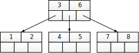
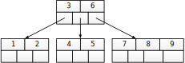
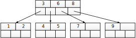
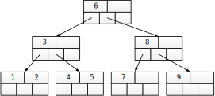

Сильноветвящиеся деревья
Сартасов С.Ю., Луцив Д.В.

B-дерево
========

- - - - - -

## Термины и определения

Придумали Р. Байер и Э. Мак-Крейт, 1972 (М. Кауфман – не опубликовал)

B-дерево порядка $2t$ (по БМК) или $2t+1$ (по Кнуту) удовлетворяет
условиям:

-   В листьях дерева хранится $t \ldots 2t$ числа.

-   В узлах дерева хранятся кроме этого ссылки на $t+1 \ldots 2t+1$
    поддерева.

- - - - - -

## Расхождения в определениях

-   Р. Байер и Э. Мак-Крейт в исходной статье листьями называли нижний
    уровень вершин с ключами, соответственно с другой аксиоматикой.
    Пустые листья предложил Д. Э. Кнут.

-   Некоторые определения оперируют количеством ключей, а не детей.

[Порядок 2 (БМК 1972) или 5 (К 1998)](https://en.wikipedia.org/wiki/B-tree#Overview)

 <!--.element: style="width: 60%;" -->

- - - - - -

## Свойства B-дерева

-   Сильно ветвистое ($t$ велико)

-   Идеально сбалансировано по высоте

-   Внутренние узлы заполнены минимум наполовину

Используется при организации индексов в СУБД и файловых систем (NTFS, BTRFS).
Нижние уровни часто выносятся во внешнюю память.

А почему?..

... А потому, что сильно ветвистое.

- - - - - -

# Вставка

1. Добавить узел в соответствующее место в соответствующем листе.

2. В случае переполнения — разделить узел на два, число посередине
   вставить в родительский узел. Повторять до корня.

- - - - - -

 <!--.element: style="width: 80%;" -->

- - - - - -

 <!--.element: style="width: 80%;" -->

- - - - - -

 <!--.element: style="width: 80%;" -->

- - - - - -

 <!--.element: style="width: 80%;" -->

- - - - - -

## Удаление

Пример с переливанием

Пусть в дереве порядка 2 (5) в одном из внутренних узлов 2 значения, а в его братьях — по 4. Одно из 2-х значений требуется удалить.
Слить уел с братьями нельзя, т.к. в братьях уже максимальное количество данных.

Выход — выбрать одного из братьев в качестве донора, переместить значение из родителя в пустой узел, а из одного из наполненных братьев — в родителя.

- - - - - -

## Оценки сложности

-   Верхняя оценка высоты - $h \le \lfloor \log_t ((N+1)/2) +1\rfloor$
-   Время поиска $\mathcal{O}(\log_2 t \log_t N)$
-   Время вставки $\mathcal{O}(\log_2 t \log_t N)$

- - - - - -

## Балансировка

* B-дерево идеально сбадансировано лишь по высоте. Если брать количество данных в разных ветвях, оно может оказаться заметно «кривым»
* В зависимости от задаи, можно переливать и при вставке, дерево будет реже разделяться, зато разделения будут затрагивать больше узлов

= = = = = =

# R-деревья

- - - - - -

