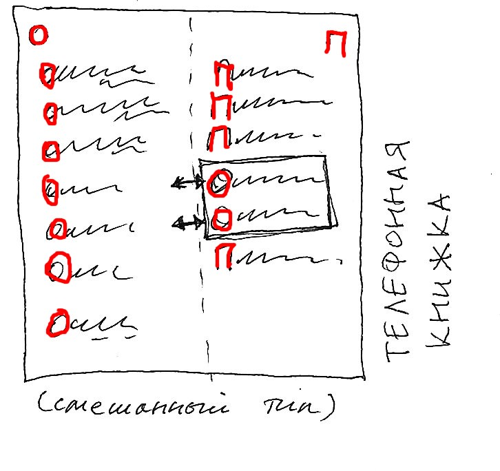
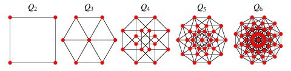

<span id="slides-title" hidden>Хэш-функции и хэш-таблицы</span>

Функции
=======

- - - - - -

Общая информация
----------------

*хэш-функция*:

$$h: A \rightarrow I^{(m)}$$

Обычно она опирается на *представление* элементов исходного множества.

Так как компьютер работает только с числами, машинные хэш-функции
рассчитаны на представление этих чисел. В общем случае под числами можно
понимать и, например, представление строк. Машинная функция обычно
вычисляется от последовательности байтов.

- - - - - -

## Хорошая хэш-функция

1.  для соседних значений аргумента обычно дает сильно различающиеся
    результаты;

2.  немонотонна и специально строится так, чтобы по её значению трудно
    был подобрать аргумент;

3.  значения предсказуемо (обычно равномерно) распределяются по области
    её значений при типичных распределениях аргументов.

Эти свойства важны при использовании хэш-функций в криптографии и для
защиты от повреждения информации.

- - - - - -

## Плохая хэш-функция

Пример плохой функции от числа или строки  — несколько (например, 16)
старших битов аргумента. Функция плохая потому что:

-   если менять младшие биты аргумента (младшие цифры числа или хвост
    строки), результат вообще не изменится;

-   функция монотонна;

-   она будет распределена, как старшие биты аргумента. Для большого
    количества чисел большой длины она будет равна 0. Для большого
    количества строк она тоже будет распределена, в зависимости от
    кодировки, предсказуемо;

-   в криптографии её использовать не стоит, т.к. по ней можно
    восстановить кусок аргумента.

- - - - - -

## Примеры

Примеры — CRC, MD5, SHA-1, SHA-2 (в порядке возрастания защищенности).
У идеальной функции защищенность пропорциональна мощности пространства
значений.

- - - - - -

## Использование

Необратимое шифрование паролей.

-{pause}-

Забавный с точки зрения математики способ использования — *Proof of Work*.

- - - - - -

## Proof of Work: подробнее

Крипотографическая задача — подбор *любого* аргумента хэш-функции, такого,
что у него заданное количество первых (или последних) битов совпадают с
указанными в условии.

### Пример применения

Одна из первых идей — борьба с почтовым СПАМом. СПАМ в целом неэффективен, но
очень дёшев. Удорожание сделает его нецелесообразным.

-{pause}-

Получив письмо, принимающий сервер задаёт отправляющему криптографическую задачу,
вычислительная сложность которой пропорциональна количеству адресатов.

- - - - - -

## Всё ещё забавно?

<div style="text-align: center;">
 <!--.element: style="width: 80%;" -->
</div>

А кто-то уже может о пенсии не беспокоиться

- - - - - -

## CRC

### Что такое CRC?

[Cyclic Redundancy Check](http://en.wikipedia.org/wiki/Computation_of_CRC). Циклический избыточный \[полиномиальный\] код.

### Остаток от деления многочленов (CRC)

```
def bits2s(bits):
    return ''.join([str(k) for k in bits])

def mod2poly(dividend, divider):
    l = len(dividend)
    print(' ' * 0, bits2s(dividend), " | ", bits2s(divider))
    print('-' * (7 + l + len(divider)))
    while len(dividend) >= len(divider):
        bfb = bits2s(dividend)
        print(' '*(l - len(bfb)), bfb)
        headneck = [ p[0]^p[1] for p in zip(dividend, divider) ]
        tail = dividend[len(headneck):]
        dividend = headneck + tail
        while len(dividend) and not dividend[0]:
            dividend = dividend[1:]
    return dividend

# CRC-1:
print(bits2s(mod2poly([1,0,1,1,0,1,1,1],[1,1])))
```

- - - - - -

## Примеры CRC

https://en.wikipedia.org/wiki/Cyclic_redundancy_check#Polynomial_representations_of_cyclic_redundancy_checks

= = = = = =

## Плохие хэш-функции

<div class="fragment" />

Они тоже нужны

- - - - - -

* [Фильтр Блума](https://en.wikipedia.org/wiki/Bloom_filter) — из нескольких хороших функций
  делается одна «плохая». Используется для хранения множеств с возможностью ложноположительного включения.
  Функции выдают номера битов, которые надо в векторе выставить в 1, для проверки вхождения в множество
  проверяется, все ли сответствующие биты вектора равны 1.

<div class="fragment" />

* Неточный строчный хэш — пример с алгоритмом Рабина-Карпа

<div class="fragment" />

* [Перцептивный хэш](http://habrahabr.ru/blogs/image_processing/120562/) — на самом деле вообще не
  хэш, ну или ооооочень плохой, но для каких-то задач эффективен. Вообще изображения классифицируются
  чаще нейронными сетями, и перцептивный хэш — примерный эквивалент свёрточных слоёв.


= = = = = =

Хэш-таблицы
===========

- - - - - -

### В нулевом приближении

Как и у деревьев, основное назначение — организация словарей.

<div class="fragment" />

Массив, который индексируется хэш-функцией ключа.

<div class="fragment" />

Важно: область значений х-ф обычно беднее области определения, поэтому
она *делит область определения на классы эквивалентности* по признаку
своего одинакового значения.

- - - - - -

Расширение
----------

- - - - - -

## Внутреннее (1)

Оно же: *открытая адресация* или *замкнутое хэширование* =).

Если мы встретились со вторым элементом какого-то класса, то ячейка
таблицы уже занята. Тогда мы идем по таблице далее (если требуется, с
переходом через 0), пока не найдем свободную. Если таблица полна, надо
её перестроить с применением более мощной хэш-функции.

При поиске мы стартуем с ячейки с номером, равным значению хэш-функции и
также идем вперед, пока не найдем нужный элемент.

Если таблица не очень сильно заполнена а хэш-функция имеет подходящее
распределение, то «перегруженность» классов эквивалентности
маловероятна.

- - - - - -

### Внутреннее (2)

Как идти вперёд?

-   на 1
-   повторным хэшированием
-   на константу

<div class="fragment" />

<div style="text-align: center;">
 <!--.element: style="width: 50%;" -->
</div>

- - - - - -


### Внешнее

*Открытое хэширование*.

<div style="text-align: center;">
 <!--.element: style="width: 60%;" -->
</div>

Изначально в ячейке хранится не одно значение, а список или даже
дерево (!). При этом таблица может расти до бесконечности (т.к. ячейки
могут расти). Но, если ячейки сильно заполнены, такую таблицу тоже стоит
перестроить.

= = = = = =

# Распределённые хэш-таблицы

- - - - - -

## Топологии: гиперкуб

<div style="text-align: center;">
 <!--.element: style="width: 60%;" -->
</div>

-   Участники сети нумеруются достаточно большими случайными числами.

-   Участник в первую очередь устанавливает связь с теми, от кто по
    номеру отличаются от него на 1 бит (метрика Кронекера).

Топология сети, таким образом, по крайней мере **пересекается** с гиперкубом.

<div class="fragment" />

РХТ существует поверх другой сети (интернета, например). И хранить все
соответствия накладно. Их можно кешировать и обновлять постепенно. При
запуске точки можно начать раскрутку с любого уже работающего узла: ему
можно сообщить свой адрес и узнать у него адреса его соседей, и т.д.,
вплоть до своих соседей.

- - - - - -

## Хранение данных

Данные дробятся на блоки. Блоки помещаются на узлы, идентификатор
которых наилучшим образом совпадает с хэш-кодом блока.

### Надёжность I

1.  Сеть ненадежна;

2.  множество узлов сети меняется;

3.  узлов на порядки меньше, чем значений хэш-функции, надо использовать
    только часть значения функции (например, первые биты) в качестве
    номера узла.

### Надёжность II

Для данных с определенным кодом всегда должен существовать и быть
доступен узел. Это технически обеспечить тяжело: надо $2^N$ узлов, где
$N$ - разрядность адреса.

Если целевой узел недоступен, работаем с ближайшими доступными вершинами
гиперкуба.

Узел при запуске в первую очередь находит «похожие» узлы и
скачивает с них данные, которые должны быть на нём. Похожесть --
симметричное отношение, так что можно, на всякий случай, скачать и
данные соседей, чтобы, если кто-то из соседей отключится, заменить его.

- - - - - -

## Топологии: кольцо (Chord)


[Вот это](https://en.wikipedia.org/wiki/Chord_(peer-to-peer&rpar;)

### Упражнение

Посмотреть и разобраться самим

= = = = = =

# Цензуроустойчивые сети

- - - - - -

## Свойства

Следующие свойства распределенных хэш-таблиц делают их устойчивыми к
принудительному выключению узлов и удалению части данных:

-   системы децентрализованы: уже работающие узлы не нуждаются в
    центральных серверах, новым для запуска нужен только один
    работающий;

-   одни и те же данные хранятся на разных машинах. При этом
    рекомендуется, если это возможно, «похожие» узлы выбирать с
    непохожими адресами несущей сети (например, с IP с разных
    континентов). Выключив одну машину, эти данные не уничтожить;

-   на одной машине лежат данные с похожими хэш-кодами, но не куски,
    например, одного и того же архива. Это частично снимает с хозяина
    узла претензии по, например, авторским правам на его данные.

- - - - - -

## Главное — думать головой

Данные по сети распространяются недетерменированно, то даже их автор не
сможет уверенно удалить их.

-   Если данные имеют принципиально временный характер, например, это
    одноразовые криптографические ключи, то это свойство не критично.

-   Если же это текст, или, например, мультимедиа, то отсутствие
    возможности удалить данные — очередной повод подумать о том, стоит
    ли эти данные публиковать.

<div class="fragment" />

### Доклад

Известные цензуроустойчивые распределённые хранилища
