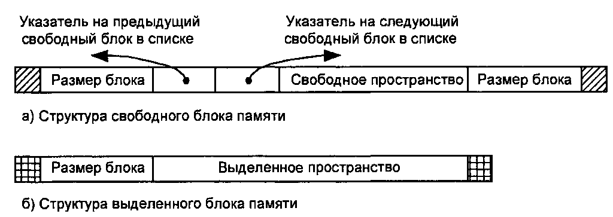
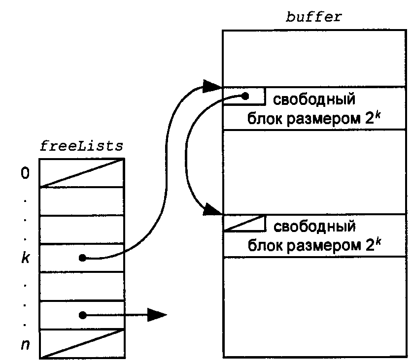

Куча

# Простейший пожход

- - - - - -

Блоки одинаковой длины
----------------------

Часто надо память выделять динамически, но фрагментами одинаковой длины

-{pause}-

### А именно

* Свободный блок хранит указатель на следующий свободный блок
* Свобоные блоки образуют стек на базе односвязного списка
* Все операции за $\mathcal{O}(1)$

-{pause}-

* [Актуально?](https://ru.cppreference.com/w/cpp/memory/allocator)
    * [Да, люди делают](https://codereview.stackexchange.com/q/82869)

= = = = = = =

# Методы подходящих

- - - - - - -

## Суть

* Программе выделяется адресное пространство
    * По мере обращения к памяти, адреса начинают отображаться на физическое ОЗУ
* Сколько-то (обычно заметно больше, чем есть физической памяти) адресного пространства выделяется под кучу
* Изначально куча свободная
* В свободной куче выделяются фрагменты требуемого размера
* Освобождённые фрагменты могут быть выделены повторно для такого же ***или меньшего*** количества данных

- - - - - - -

## Детали

* Свободные фрагменты хранятся в списке
* Список м.б. одно- или двусвязным
* В свободном блоке хранится длина и указатели на следующий и
  предыдущие свободные, в занятом — только длина
* При освобождении блоки надо сливать, *дефрагментируя* кучу

* Да, опять проблемы начинают отложенно сказываться при удалении...

- - - - - -

## Наивная реализаация

 <!--.element: style="width: 80%;" -->

- - - - - -

## Главный недостаток

При возвращении блока в список свободных требуется искать, в какое
место его поставить. Т.е. можно либо медленно освобождать память,
сохраняя упорядоченность списка по адресам, либо освобождать быстро, но
медленно дефрагментировать, бегая по неупорядоченному списку в поисках
соседних блоков.

- - - - - -

## Вариации

* Метод первого подходящего
* Метод следующего подходящего
* Метод случайного подходящего
    * Медленнее выделение, но, как и с декартовым деревом, позволяет долго не дефрагментировать кучу

- - - - - -

Метод граничных маркеров
------------------------

### Суть

Позволяет оптимизировать дефрагментацию. Для этого на концах блока
памяти, свободного или занятого, записываются маркеры, показывающие его
состояние. Кроме того, на *обоих* концах свободного блока записывается
его длина. Это позволяет быстро выяснить, заняты ли следующий и
предыдущий блоки и произвести возможные слияния. У выделенного блока
длина хранится только в начале.

 <!--.element: style="width: 80%;" -->

- - - - - -

## Замечание

Такая система позволяет, вообще говоря, совсем отказаться от списка,
т.к. из каждого блока можно получить его размер, а значит и адрес
следующего, и, более того, если предыдущий свободен (иначе не нужно), то
и адрес предыдущего. Но тогда свободные искать долго.

- - - - - -

### Недостаток

Накладные расходы по памяти. Нужно место под:

* маркеры;

* для свободного блока — под две копии длины, что не страшно, т.к. у
  занятого тоже одна копия хранится, т.е. можно выделить
  `sizeof(void *)` памяти.

- - - - - -

## Благодарность

Использованы иллюстрации из книги:

[Кубенский А. А.](http://edu.ifmo.ru/teacher/125566/)
[Структуры и алгоритмы обработки данных. Объектно-ориентированный подход и реализация на C++](https://books.google.ru/books?isbn=5941575068)

- - - - - -

Метод двоичных близнецов
------------------------

### Выделение

-   Позволяет распределять память только блоками по $2^k$
    ячеек.

-   Заводится массив, $k$-й элемент которого хранит указатель на первый
    свободный элемент размером $2^k$. Свободный элемент хранит указатель
    на следующий.

-   Если блок нужного объема есть, то он выделяется и убирается из
    списка. Если нет, то выделяется (рекурсивно) блок в два раза
    больший, разбивается пополам, половина предоставляется программе, а
    её близнец отправляется в список свободных. Рекурсия может дойти
    доверху.

- - - - - -

 <!--.element: style="width: 80%;" -->

- - - - - -

 <!--.element: style="width: 80%;" -->

- - - - - -

## Освобождение и дефрагментация

-   Каждый блок размером $2^k$ начинается с адреса, кратного $2^k$ (если
    считать от начала кучи).

-   По адресу и размеру любого блока можно найти его
    «близнеца», определив, является ли наш блок первым или вторым.

Близнец хранится в списке свободных блоков данного размера?

-   Нет. Добавляем освобождаемый блок в список и ничего больше не
    делаем.

-   Да. Убираем близнеца из списка свободных и рекурсивно пытаемся
    освободить уже вдвое больший блок, состоящий из исходного блока и
    его близнеца. Рекурсивно повторяем, пока можно.

- - - - - -

## А ещё

На троичной машине логично бы было сделать не двойняшек, а тройняшек
