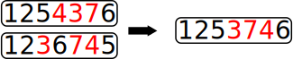
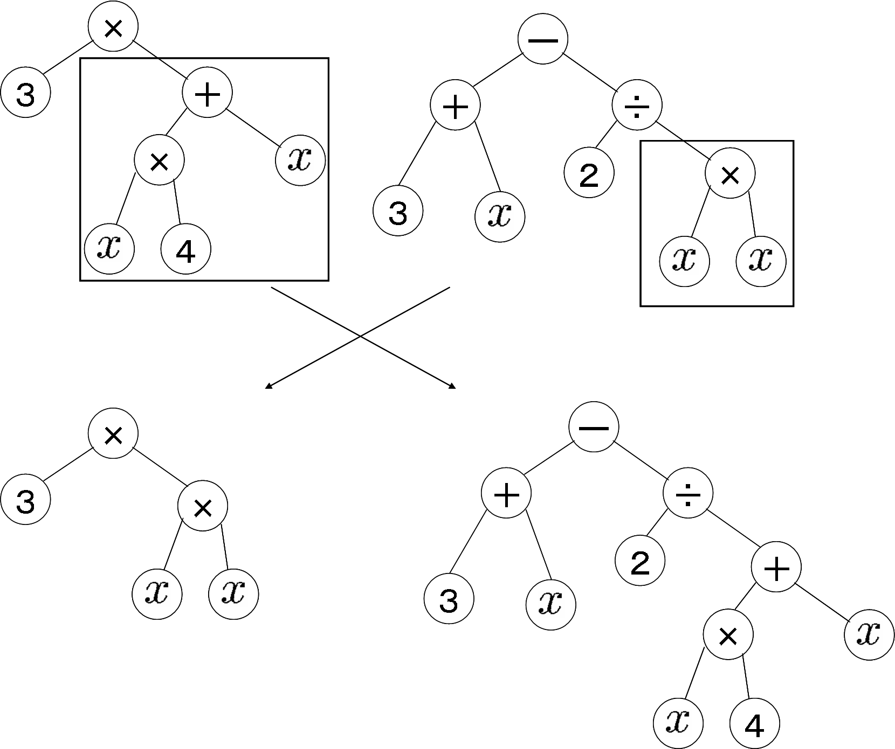

Эволюционные алгоритмы

Генетические алгоритмы
======================

- - - - - -

Теория
------

- - - - - -

## Сразу небольшой пример

Чтобы на фоне считался

https://rednuht.org/genetic_cars_2/

- - - - - -

## Качество и геномы

Пусть задано пространство геномов $G$ и функция качества на нём:

$$Q = \\{ f: G \rightarrow \mathbb{R}^{+} \\}$$

Вообще говоря, функция качества может вычисляться очень долго, так как
она имитирует жизненный цикл особи как минимум до конца репродуктивного
периода.

- - - - - -

## Замечания

- Геном может быть интерпретирован по-разному. Это может быть таблица
  значений функций, управляющая таблица автомата и т.д. Текст
  программы эволюционирует неэффективно (почему?) Подход к
  генетическим изменениям программ называется генетическим
  программированием.

- Функция качества может считаться как «в гордом одиночестве»,
  так и «турнирно», особенно если для особей осмысленна
  внутривидовая конкуренция.

- - - - - -

## Операции

На пространстве геномов заданы операции:

-   селекция:

$$s: 2^G \times Q \rightarrow 2^G,$$

-   скрещивание:

$$c: G \times G \rightarrow G,$$

-   мутация:

$$m: G \rightarrow G,$$

-   элитизм:

$$e: 2^G  \times Q \rightarrow 2^G.$$

- - - - - -

### Селекция

Отбирает из поколения подмножество заданного наперёд размера (доля $c < 1$
от исходного) по максимуму функции качества:

<!-- $$G'_i = \\{g' \in G_i | f(g') \geq f(g) \forall g \in G_i \backslash G'_i \\} ~|~ ||G'_i|| = c||G_i||.$$ -->

$$ G'_i \subset G_i: \\#G'_i \approx c \\#G_i; \forall g' \in G'_i \forall g \in G_i g' \ge g. $$ 

-{pause}-

Может задаваться не при помощи сортировки, а «стохастически».
Берутся случайные особи, но вероятность их использования «для расплода»
пропорциональна их качеству:

$$ \mathrm{P}(g' \in G'\_i) = c \frac{f(g')}{\sum\_{g \in G\_i}f(g)}. $$

- - - - - -

### Формирование $G_{i+1}$: скрещивание, мутация

$G_{i+1}$ формируется после селекции на основе $G'_i$.

 

Эти операции восполняют объём популяции, возвращая недостающую долю
$1-c$.

обычно лучшие особи скрещиваются в произвольных сочетаниях, но от
механизма выбора этих сочетаний может зависеть и выбор $c$. Например,
если $c = \frac{1}{10}$, то для восполнения 100 особей надо скрестить
всех со всеми.

С определённой небольшой вероятностью к особям применяется мутация,
случайно меняющая часть генома.

При скрещивании геномы смешиваются, обычно, не хаотически, а крупными
фрагментами.

- - - - - -

### Консервативность: элитизм

Несколько особей с наилучшими показателями не подвергаются мутации и
скрещиванию и переносятся, согласно принципу элитизма, в следующее
поколение.

- - - - - -

### Остановка алгоритма

Выполняется в зависимости от конкретной задачи.

Например, если по какой-то метрике поколения перестают мутировать
(фундаментальная сходимость): $\mu(G\_i, G\_{i+1}) < \varepsilon$.

Или если $f$ достигает требуемого значения.

- - - - - -

Пример
------

### Задача коммивояжёра

Геном — перестановка, задающая последовательность точек. Функция
качества — пройденное расстояние (надо минимизировать).

Селекция и элитизм очевидны, мутация — перестановка 2-х точек.

Скрещивание перестановок уже не так очевидно.

-{pause}-

Например, выбирается последовательная часть точек в
геноме «мамы», и они сортируются в том порядке, в котором они
встречаются у «папы»:

 <!--.element: style="width: 60%;" -->

- - - - - -

Реализации
----------

### Тысячи их

https://duckduckgo.com/?q=genetic+algorithm+framework

-{pause}-

В 2011 году второкурсники Матмеха СПбГУ написали без использования
библиотек (самостоятельно) две программы:

-   Решения
    [диофантовых уравнений](https://ru.wikipedia.org/wiki/%D0%94%D0%B8%D0%BE%D1%84%D0%B0%D0%BD%D1%82%D0%BE%D0%B2%D0%BE_%D1%83%D1%80%D0%B0%D0%B2%D0%BD%D0%B5%D0%BD%D0%B8%D0%B5)

-   Селекции животных в гипотетическом мире (лучше всего проявили себя
    животные с густой шерстью весом около 50 кг и с пятью конечностями).

= = = = = =

Генетическое программирование
=============================

- - - - - -

Теория
------

### Подвиды

-   Прямое кодирование — генетический алгоритм работает с программой в
    явном виде.

-   Косвенное кодирование — генетический алгоритм работает не с самим
    кодом программы, а с правилами его построения. То есть генетический
    алгоритм работает с программой, которая генерирует нужную нам
    программу.

-   При использовании ленивых языков эти различия можно несколько
    размыть.

- - - - - -

### Метагенетическое программирование

Метагенетическое программирование — это ГП, в котором изменяется и,
тем самым, «выращивается» не только заданная компьютерная программа, но
и сами применяемые операторы скрещивания и мутации.

- - - - - -

Пример
------

### Скрещивание

 <!--.element: style="width: 60%;" -->

[См](https://ru.wikipedia.org/wiki/%D0%93%D0%B5%D0%BD%D0%B5%D1%82%D0%B8%D1%87%D0%B5%D1%81%D0%BA%D0%BE%D0%B5_%D0%BF%D1%80%D0%BE%D0%B3%D1%80%D0%B0%D0%BC%D0%BC%D0%B8%D1%80%D0%BE%D0%B2%D0%B0%D0%BD%D0%B8%D0%B5).

- - - - - -

Реализации
----------

* [Тысячи их](https://en.wikipedia.org/wiki/Genetic_programming#Implementations)

-{pause}-

* Ваш покорный слуга в возрасте лет 13 или 14 заполнял случайными числами
память своего  и запускал.
Иногда получалось интересно. Но по-настоящему интересно — ни разу. Вот
что значит стремление без знаний =).

-{pause}-

### Упражнение

Не хватает только вашей

- - - - - -

 <!--.element: style="height: 60%;" -->

### Упражнение

Подумать и убедительно рассказать о том, каким образом
теоретически можно путём эволюции генетических и метагенетических систем
(не забывать и про функцию качества) создать программную систему,
которая будет конкурировать с цивилизацией людей.
