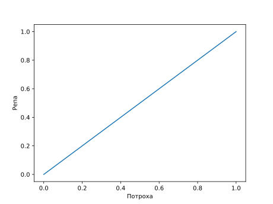
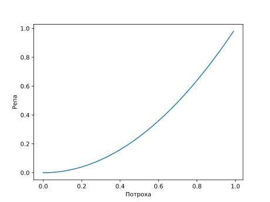
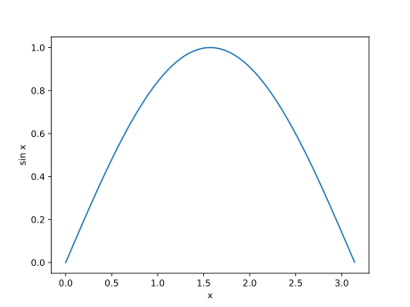
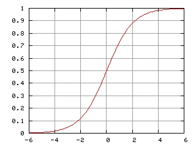

<span id="slides-title" hidden>Классификаторы</span>

Это тоже относится к машинному обучению =)

= = = = = =

Наивный байесовский классификатор
=================================

- - - - - -

## Совсем простой пример

1. Приходит электронная почта
2. Письмо отправляется в [СПАМ](https://en.wikipedia.org/wiki/Email_spam) или нет по решению пользователя
    * Если письмо отправляется в СПАМ, всем словам, из которых состоит его текст, **убавляется репутация**
    * Если письмо хорошее, всем словам **репутация прибавляется**
3. По прошествии некоторого времени система предлагает пользователю решения, а пользователь соглашается, или нет
4. По прошествии ещё какого-то времени пользователя больше не спрашивают


-{pause}-

Система может остановить обучение, или доучиваться постепенно в расчёте на то, что СПАМ будет медленно эволюционировать

- - - - - -

## Другая частая ситуация

Требуется не бинарная, а более тонкая классификация


- - - - - -

Постановка задачи
-------

Пусть есть множество объектов $O$. Объекты $o \in O$.

Есть набор категорий $C$. И категории $c \in C$.

Требуется классифицировать объект:

$$ c(o) = \arg\max_{c \in C} \mathrm{P}(c | o)$$

-{pause}-

Или просто вычислить вероятности $\mathrm{P}(c), c \in C$

- - - - - -

## Ещё немного теории

Теорема [Байеса](https://en.wikipedia.org/wiki/Thomas_Bayes):


$$ \mathrm{P}(c|o) = \frac{\mathrm{P}(o|c)\mathrm{P}(c)}{\mathrm{P}(o)} $$


- - - - - -

## Признаки объекта

Например, наличие определённых слов в тексте. А чаще не слов, а [N-грамм](https://en.wikipedia.org/wiki/N-gram).

Для объекта $o \in O$ — $o_1,\ldots,o_N$.

-{pause}-

$$\mathrm{P}(o) = \mathrm{P}(o\_1,\ldots,o\_N) = \prod\_{i=1}^N\mathrm{P}(o\_i)$$

-{pause}-

$$\ldots = 1,$$

когда мы работаем с объектом $o$, т.к. у него все эти признаки есть.

- - - - - -

## И формула упрощается

$$\mathrm{P}(c|o) = \mathrm{P}(c) \prod\_{i=1}^N\mathrm{P}(o\_i | c) $$

-{pause}-


А если хочется вынести окончательный вердикт, то

$$ c(o) = \arg\max_{c \in C} \mathrm{P}(c|o).$$

- - - - - -

## Пример ([Отсюда](https://habr.com/ru/post/120194/)): обучение


```
from collections import defaultdict

def train(training_data):
    categorie_powers = defaultdict(lambda: 0)
    frequencies = defaultdict(lambda: 0)

    for feature_list, category in training_data:
        categorie_powers[category] += 1
        for feature in feature_list:
            frequencies[category, feature] += 1


    # p(o|c)
    for category, feature in frequencies.keys():
        frequencies[category, feature] /= categorie_powers[category]

    # p(c)
    for c in categorie_powers.keys():
        categorie_powers[c] /= len(training_data)

    return categorie_powers, frequencies

```

- - - - - -

## Пример: классификация (упрощённо, [линейная классификация](https://en.wikipedia.org/wiki/Linear_classifier))


```
def classify(knowledge, feature_counts):
    c_probs, o_probs = knowledge

    r = defaultdict(lambda: 0)
    for c in c_probs.keys():
        for f in feature_counts.keys():
            r[c] += c_probs[c] * o_probs[c, f] * feature_counts[f]

    return r
```

Реально для байесовских классификаторов используюются немного другие статистические модели, но суть примерно такая.


- - - - - -

## Пример: использование


```
k = train([
    (["мясо", "рыба", "потроха"], "мясоед"),
    (["молоко", "рыба", "яйца", "репа"], "умеренный вегетерианец"),
    (["вода", "укроп", "репа"], "веган")
])

print(dict(classify(k, {"мясо": 4, "рыба": 3})))

print(dict(classify(k, {"потроха": 1, "репа": 5})))

```

Выдаёт

```
{'мясоед': 2.333333333333333, 'умеренный вегетерианец': 1.0, 'веган': 0.0}
{'мясоед': 0.3333333333333333, 'умеренный вегетерианец': 1.6666666666666665, 'веган': 1.6666666666666665}
```

- - - - - -

## Ссылки

Доходчивые и простые

1. [Тоби Сегаран. Программируем коллективный разум: \[пер. с англ.\] // М. — Символ-Плюс, 2008, 368 с.](https://books.google.ru/books?isbn=5932861193)
2. https://habr.com/ru/post/120194/

= = = = = =

Что может и чего не может НБК?
==============================

- - - - - -

```
    for c in c_probs.keys():
        for f in feature_counts.keys():
            r[c] += c_probs[c] * o_probs[c, f] * feature_counts[f]

```

Так это же...

-{pause}-

... првильно, ***линейная классификация***, т.е.

коль скоро $f$ — `feature_counts` — вектор, $c$ — `c_probs` — вектор, а $O$ — `o_probs` — матрица, то:

$$ r = c^{T} \, O \, f$$

- - - - - -

### Что он может

<div style="text-align: center;">
 <!--.element: style="height: 30%;" -->
</div>

-{pause}-

### Чего он не может

<div style="text-align: center;">
 <!--.element: style="height: 30%;" -->
</div>


- - - - - -


## Известная картинка

<div style="text-align: center;">
 <!--.element: style="height: 40%;" -->
</div>

Из Википедии

-{pause}-

Линейный классификатор может работать, когда данные уже такие, как справа. Потому, что он **линейный**.

= = = = = =

# Ступенчатая аппроксимация функции

- - - - - -

## Синус

<div style="text-align: center;">
 <!--.element: style="height: 50%;" -->
</div>

- - - - - -

## Аппроксимация синуса

<div style="text-align: center;">
 <!--.element: style="height: 50%;" -->
</div>

- - - - - -

## Чем можно аппроксимировать?

* Прямоугольниками
* «Колокольчиками»

-{pause}-

* «Половинками» от того и дргого

- - - - - -

## Почти половинка от колокольчика

Сигмоида

<div style="text-align: center;">
 <!--.element: style="height: 600px;" -->
</div>

$$\sigma(x) = \frac{1}{1 + e^{-x}}$$

= = = = = =

# Градиентный спуск

- - - - - -

## В целом

Умеем вычислять $f(x)$, но знаем мало её свойств. Надо найти $\arg\min_x f(x)$.

-{pause}-

Берём случайный $x$, а дальше

$$x \gets - \lambda\nabla f(x)$$

- - - - - -

## Теперь давайте не по $x$, а по параметрам


$$f(x) \approx \frac{1}{N} \sum\_{i=1}^{N} \sigma(a_ix + b_i)$$

Надо подобрать $a_i$ и $b_i$ в количестве $2N$ штук.

-{pause}-

Мы для различных $x$ берём:

$$b_i \gets b_i - \lambda \frac{\partial f}{\partial b_i}$$

и

$$a_i \gets a_i - \lambda \frac{\partial f}{\partial a_i}$$

- - - - - - -

## Теперь давайте минимизировать композицию

$ z = g(y), y = f(x)$, т.е. $z = (g \circ f)(x)$

-{pause}-

Т.е. надо:

* Взять случайный $x$, вычислить по нему $y$ и $z$
* При помощи $\nabla g$ вычислить, насколько должен измениться $y$, т.е. получить $\Delta y$
* Следующий $x \gets x + \lambda (\Delta) \nabla g$

- - - - - -

## То, что получилось, называется обратным распространением ошибки

