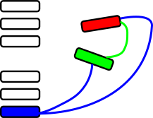

<span id="slides-title" hidden>Стек: статические и динамические цепочки</span>

# Область видимости и связывание

- **Свзывание** (**binding**) — сопоставление имени (идентификатора) сущности
- **Область видимости** (**scope**) — область действия связывания (в программе)

@pause@

Видимость в разных языках:

- Лексическая (по структурным конструкциям)
  - Локальные в С, `nonlocal` в Python, `let` в JavaScript
- Динамическая (по времени работы функции)
  - Python, `var` в JavaScript

= = = = = =

Языки без вложенных контекстов
==============================

- - - - - -

## C (но уже не C++)

<div style="text-align: center;">

 <!--.element: style="zoom: 1.5;" -->

</div>


= = = = = =

Языки с вложенными контекстами
==============================

- - - - - -

### Статическая и динамическая цепочки

-   **Динамическая цепочка** (**Dynamic Link**) --- последовательность кадров вызывающих друг
    друга процедур на стеке

-   **Статическая цепочка** (**Static Link**) --- последовательность
    кадров лексических контекстов

- - - - - -

### Без передачи процедур

<div style="text-align: center;">

 <!--.element: style="zoom: 1.5;" -->

</div>

= = = = = =

Языки с передачей процедур
==========================

- - - - - -

## [Проблема фунарга](http://ru.wikipedia.org/wiki/%D0%9F%D1%80%D0%BE%D0%B1%D0%BB%D0%B5%D0%BC%D0%B0_%D1%84%D1%83%D0%BD%D0%B0%D1%80%D0%B3%D0%B0)

*В два слова, но с маленькой буквы*

При наличии в языке вложенных процедур необходимо:

-   передавать представление замыкания --- адрес кода процедуры и
    данные, необходимые для доступа к внешним лексическим контекстам

-   обеспечивать существование внешних контекстов до окончания
    возможности доступа к ним (целостность статической цепочки)

- - - - - -

## История вопроса

 <!--.element: style="zoom: 1.2;" -->  <!--.element: style="zoom: 1.2; transform: scaleX(-1);" -->

- - - - - -

## Лексическое замыкание

```
(define (middle f)
  (let ((x 998))
    (f 1)
    )
  )
(define (outer)
  (let ((x 122))
    (let ((inner (lambda (y)
                     (display (+ x y))
                     )
                   ))
        (middle inner)
        )
    )
  )
(outer)
```

Это Scheme (Guile, R5RS). Выдаст 123. Как и ожидалось.

- - - - - -

## Динамическое замыкание

```
(defun middle(f)
  (let ((x 998)) ; comment this out
    (apply f '(1))
    )            ; comment this out
  )
(defun outer()
  (let ((x 122))
    (let ((inner (lambda (y)
                   (print (+ x y))
                   )
                 ))
      (middle inner)
      )
    )
  )
(outer)
```

Это Emacs LISP (версия 23). Выдаст 999!

- - - - - -

## Нисходящий фунарг (1): передача конца цепочки и мониторного массива

Вместе с адресом кода можно передать:

-   ссылку на нижний объемлющий кадр
-   ссылки на все объемлющие кадры

Таким образом, дополнительных осложнений не возникает

Algol 68, Pascal (простые диалекты), блоки в Ruby

- - - - - -

## Нисходящий фунарг (2): вытянутая статическая цепочка

<div style="text-align: center;">

  <!--.element: style="zoom: 1.5;" -->

</div>

Адрес объемлющего кадра не известен сам по себе (процедуру могли
передать через много вызовов), поэтому его надо указать явно.

- - - - - -

## Нисходящий фунарг (3): Мониторный массив

<div style="text-align: center;">

  <!--.element: style="zoom: 1.5;" -->

</div>

Можно разом передать адреса всех объемлющих кадров в специальной
структуре данных --- «мониторе», которую для работы внутренней
создаёт и размещает внешняя процедура. Быстрее, но больше памяти.

- - - - - -

## Восходящий фунарг (1): возврат и глобальное хранение процедур

Проблема более общая и решение тоже.

Когда вложенную процедуру возвращают наружу (наверх) или ссылку на неё
сохраняют в глобальной переменной, возникает техническая проблема:

Статическая цепочка перестаёт быть подмножеством динамической.

- - - - - -

## Восходящий фунарг (2): константные кадры на стеке

<div style="text-align: center;">

  <!--.element: style="zoom: 2.5;" -->

</div>

Если внешние данные изменять не нужно или нельзя (а особенно если их
немного), то данные для работы внутренней процедуры можно просто
скопировать и передать вместе со ссылкой на код.

Достаточно буквально соответствует $\beta$-редукции
$\lambda$-исчисления. Используется в LISP, ML, Java.

- - - - - - -

## Восходящий фунарг (2): кадры в куче

<div style="text-align: center;">

  <!--.element: style="zoom: 2.5;" -->

</div>

Если данных вешней процедуры много (копировать не хочется) или если их
требуется изменять, можно выделить кадр (или нужную часть кадра) внешней
процедуры в куче.

Python, C\#, Scala, $\lambda$-выражения в Ruby.

- - - - - -

Оптимизация фунарга
-----------

-   Распознавать частные случаи и применять максимально простые
    допустимые решения.

-   Умудряться при этом не нарушать общности, чтобы разные процедуры
    можно было вызывать одинаково --- вызывающая-то не знает.

    -   Зато вызываемая знает, *что* ей должны передать. Так что можно
        просто передавать адрес процедуры и «$n$ байтов данных», в
        которых разбираются она и внешняя, а вызывающие не обязаны.

Пример: «родной» (от MS) компилятор C\# распознаёт вложенные
процедуры, которые не возвращают наверх, и передаёт им конец цепочки со
стека (оптимизация).

= = = = = =

### Вопросы

* Что такое область видимости и связывание?
* Что такое лексическая и динамическая видимость?
* Дайте определение статической цепочки
* Дайте определение динамической цепочки
* Что такое фунарг, восходящий и нисходящий?
* Опишите способы решения проблемы нисходящего фунарга
* Опишите способы решения проблемы восходящего фунарга

### Упражнения

* Измерьте скорость обращения к локальным переменным и переменным разных контекстов